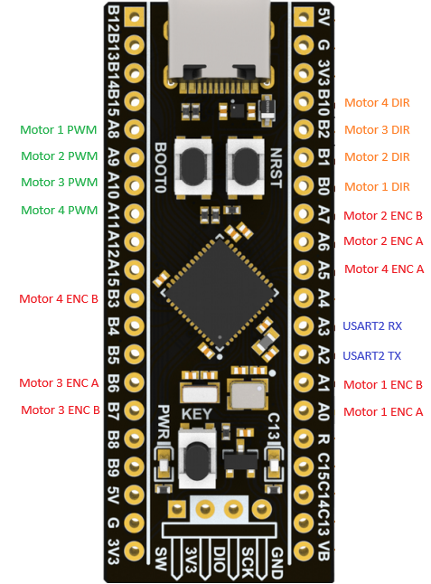

# STM32 Black Pill PID Motor Controller

A PID-based motor control system for the STM32F411 Black Pill microcontroller, designed to control 4 DC motors with encoders via H-bridge drivers (e.g., DRV8871).

## Features

- **High-frequency PID control**: 1 kHz PID loop running on TIM10 interrupt
- **Encoder feedback**: 100 Hz encoder updates (quadrature decoding)
- **4 independent motor channels**: Each with PWM speed control and direction control
- **Configurable PID gains**: Kp, Ki, Kd parameters per motor
- **Anti-windup protection**: Integral clamping to prevent windup

## Hardware Configuration

### Motor Specifications
- Encoder: 7 PPR (basic) × 4 (quadrature) × 150 (gear ratio) = **4200 counts/revolution**
- PWM Frequency: Configured via TIM1
- Control Loop: 1 ms update period (1 kHz)
- Encoder Reading: 10 ms update period (100 Hz)

### System Clock
- **84 MHz SYSCLK** derived from 25 MHz HSE crystal
- Configured with PLL (PLLM=25, PLLN=336, PLLP=4)

## Pinout

| Function | Pin | Timer/Channel |
|----------|-----|---------------|
| **Motor 1 PWM** | PA8 | TIM1 CH1 |
| **Motor 2 PWM** | PA9 | TIM1 CH2 |
| **Motor 3 PWM** | PA10 | TIM1 CH3 |
| **Motor 4 PWM** | PA11 | TIM1 CH4 |
| **Motor 1 DIR** | PB0 | GPIO |
| **Motor 2 DIR** | PB1 | GPIO |
| **Motor 3 DIR** | PB2 | GPIO |
| **Motor 4 DIR** | PB10 | GPIO |
| **Motor 1 Encoder A** | PA0 | TIM5 CH1 |
| **Motor 1 Encoder B** | PA1 | TIM5 CH2 |
| **Motor 2 Encoder A** | PA6 | TIM3 CH1 |
| **Motor 2 Encoder B** | PA7 | TIM3 CH2 |
| **Motor 3 Encoder A** | PB6 | TIM4 CH1 |
| **Motor 3 Encoder B** | PB7 | TIM4 CH2 |
| **Motor 4 Encoder A** | PA5 | TIM2 CH1 |
| **Motor 4 Encoder B** | PB3 | TIM2 CH2 |
| **USART2 TX** | PA2 | USART2 |
| **USART2 RX** | PA3 | USART2 |
| **LED** | PC13 | GPIO (onboard) |

## PID Configuration

Default PID gains (defined in [`motor.h`](include/motor.h)):
- **Kp**: 0.1
- **Ki**: 0.125
- **Kd**: 0.0
- **Integral Limit**: 5.0 (anti-windup)
- **Output Range**: -1.0 to 1.0 (bidirectional control)

## Motor Control Functions

The [`motor.c`](src/motor.c) module provides:
- `Motor_SetTargetRPM()`: Set target velocity in RPM
- `Motor_Forward()`: Drive motor forward with duty cycle
- `Motor_Reverse()`: Drive motor in reverse with duty cycle
- `Motor_Break()`: Active braking (both H-bridge outputs high)
- `Motor_Coast()`: Free-running coast (both outputs low)

## Building

This project uses **PlatformIO**. To build and upload

## Error Handling

The [`Error_Handler()`](src/main.c) function provides visual feedback via fast blinking of the onboard LED (PC13) if system initialization fails.